# PhysiGo

Physics playground for Inclined Plane and Projectile Motion


## 🇮🇹 ITALIANO

PhysiGo è un simulatore che permette di ricreare delle situazioni di piano inclinato e di moto del proiettile, visualizzare la scena ricreata e i dati in tempo reale d'esecuzione. È possibile inserire i dati manualmente o importare i problemi da file. I dati in input sono verificati per evitare dati scorretti o incongruenze (es. massa < 0)

<details>
<summary><strong>Piano Inclinato</strong></summary>

#### Inserimento Dati

Inzialmente bisogna scegliere se si vuole simulare un blocco solido o un corpo rotatorio: nel secondo caso si seleziona il tipo di elemento rotatorio (es. Sfera, Cilindro Vuoto)

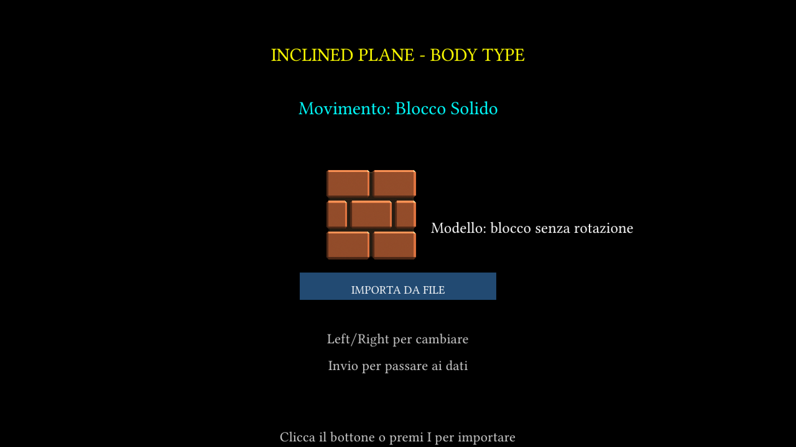
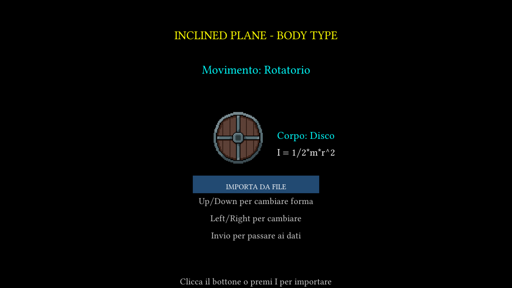

A questo punto, vanno inseriti i dati. I dati da inserire sono i seguenti:

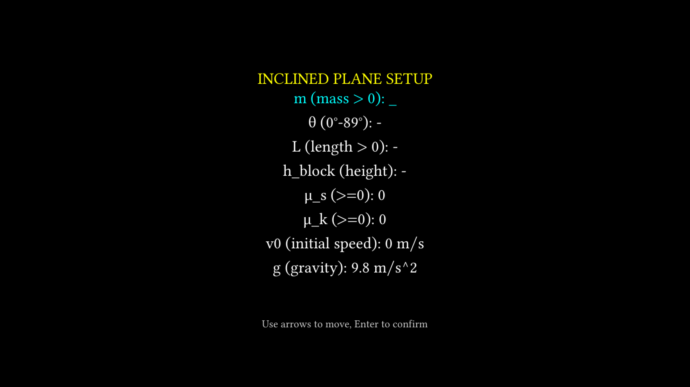

- Massa
- Angolo
- Lunghezza Piano
- Altezza Iniziale Blocco
- Coefficiente Statico
- Coefficiente Dinamico
- Velocità Iniziale
- Gravità

E nel caso dell'elemento rotatorio, anche:

- Raggio

I dati inseriti devono essere fisicamente corretti (es. valori non negativi, angolo tra 0° e 89° per avere un piano inclinato etc.) e sensati: se inserisco un determinato angolo e lunghezza di piano, l'altezza massima possibile del blocco viene calcolata automaticamente con L * sin(angolo). Se viene inserita una h maggiore di questo valore, avrò un errore (uguale al contrario)

#### Simulazione

Una volta che i dati sono stati correttamente inseriti e validati, viene avviata una simulazione

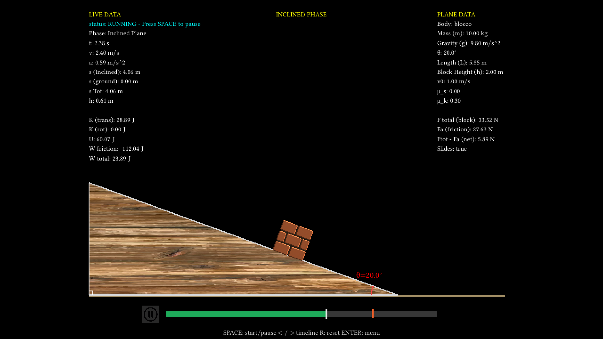

Nella simulazione sono presenti diverse sezioni:

**PLANE DATA**

Mostra i dati inziali del problema (inseriti dall'utente) e le varie forze

- F Totale sul blocco
- F Attrito
- F Netta (Totale - Netta)

**LIVE DATA**

Mostra i dati in tempo reale della simulazione

- Tempo
- Velocità
- Accelerazione
- Spostamento (sul piano)
- Spostamento (orizzontale)
- Spostamento Totale
- Altezza del blocco

- Energia Cinetica (Tran e rot)
- U
- W (Lavoro Frizione)
- W Totale

Quando la simulazione termina, compaiono al centro dello schermo i dati riassuntivi:

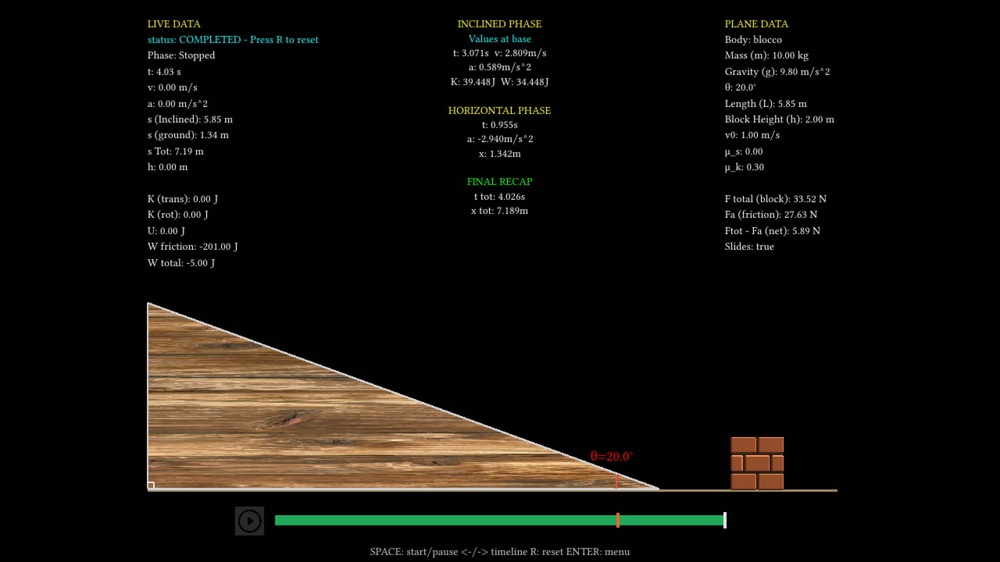

- Inclined Phase: Mostra T totale, Velocità, Accelerazione, K e W al momento del raggiungimento della base del piano
- Horizontal Phase: Mostra lo Spostamento, il Tempo e La Decelerazione avvenuti sul piano orizzontale
- Final Recap: Mostra il Tempo e lo Spostamento totali

**Elemento Rotatorio**

Nel caso dell'elemento rotatorio sono presenti delle piccole differenze

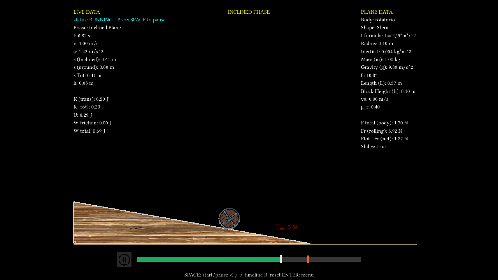

In questo caso vengono anche mostrati il Raggio, la formula I per la forma scelta e il coefficiente rotazionale

#### Casi Particolari

**Niente Attrito**

Se non viene inserito nessun coefficiente dinamico (situazione ovviamente ideale) il blocco andrà avanti all'infinito uscendo dallo schermo e verrà stampato un messaggio per segnalarlo

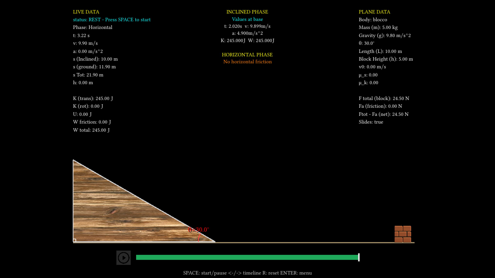

**Niente Movimento**

Se con i dati inseriti risulta che il blocco non si muove, il simulatore ovviamente non si avvierà e verrà stampato un apposito messaggio

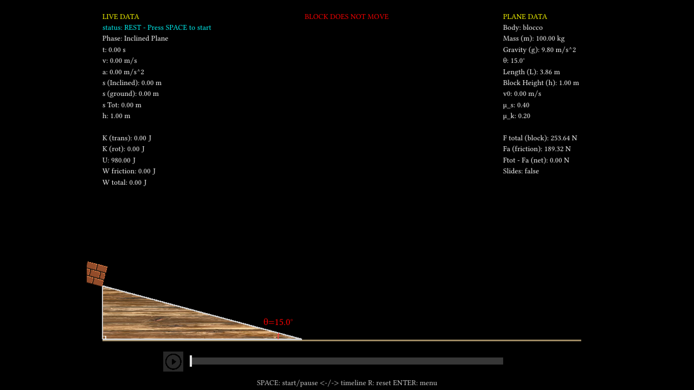
</details>

<details>
<summary><strong>Moto Del Proiettile</strong></summary>

#### Inserimento Dati

Come per il piano inclinato, viene richiesto di inserire i dati del problema

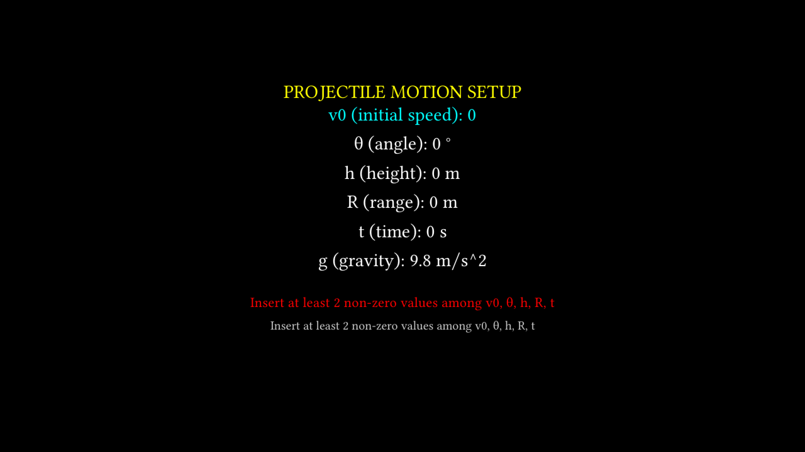

I dati da inserire sono:

- Velocità Iniziale
- Angolo
- Altezza Iniziale
- Gittata
- Tempo
- Gravità

Il sistema è implmentato con le formule inverse: è in grado di calcolare i valori in base ai dati forniti: ad esempio se vengono inseriti solo Gittata e Angolo, sarà in grado di calcolare la velocità iniziale con la formula inversa e avviare la simulazione

#### Simulazione

Quando viene avviata la simulazione sarà visualizzata una simulazione real time del lancio

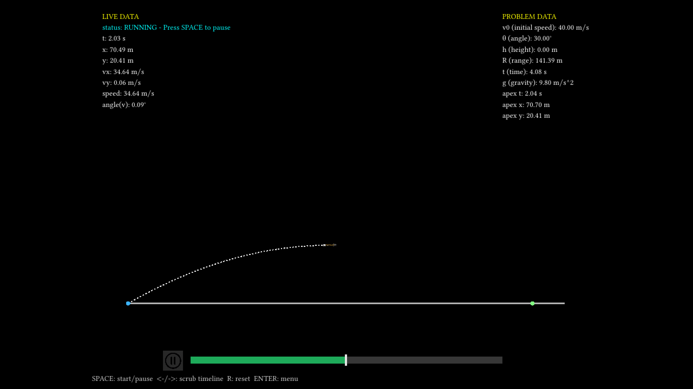

In PROBLEM DATA sono mostrati i dati iniziali inseriti dall'utente, mentre in LIVE DATA sono mostrati in tempo reale

- Tempo
- Posizione X e Y
- Velocità X e Y
- Velocità Totale
- Angolo

Alla fine della simulazione, in alto saranno mostrati Tempo di Volo, Gittata e Altezza Massima Raggiunta

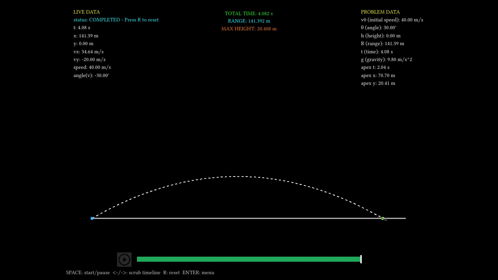

Se durante l'inserimento dei dati inserisco un valore di altezza diverso da 0, il proiettile partirà dall'altezza selezionata

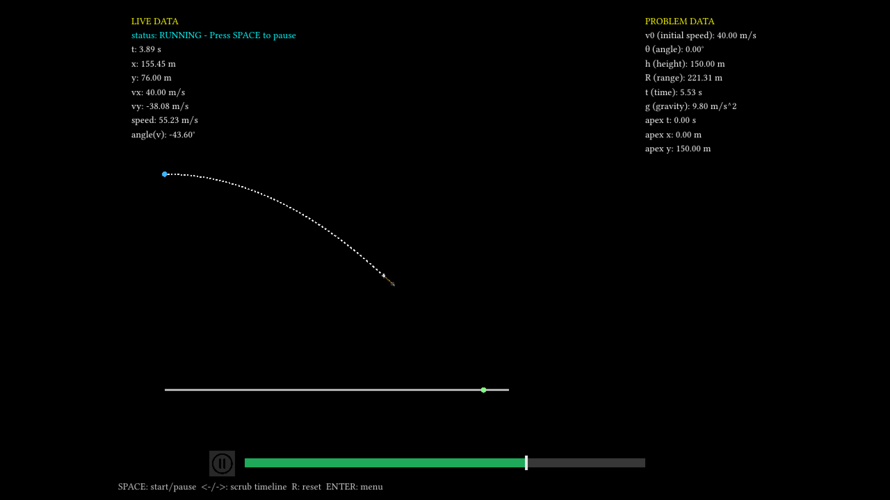

</details>

<details>
<summary><strong>Comandi</strong></summary>

Nei Menù:
- Mouse disponibile
- Frecce UP/DOWN e LEFT/RIGHT per selezionare
- SPACE per aprire il menù di pausa

In Inclined Plane:
- I per importare da file
- INVIO per inserire i dati

In Simulatore:
- SPACE per fare PLAY/PAUSE
- R per resettare la scena
- Sulla barra ci si può muovere con il mouse o con LEFT/RIGHT
- INVIO per aprire il menù di pausa

ESC per passare da finestra a schermo intero e viceversa
</details>

<details>
<summary><strong>Importazione Da File</strong></summary>

L'importazione da file è supportata solo per il Piano Inclinato. Cliccando sul pulsante relativo (o premendo I) nel menù di inserimento, sarà possibile scegliere tra vari problemi nella cartella `examples`

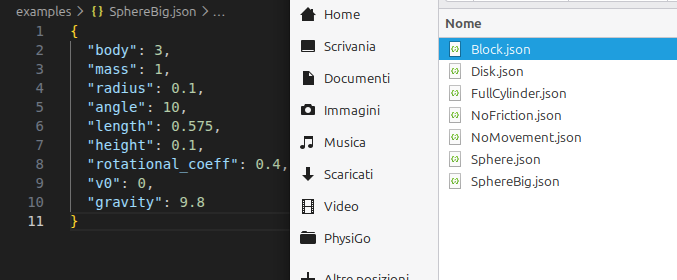

I problemi possono essere scritti sotto forma di file `.json`, per poi essere salvati nella cartella examples ed essere importati più velocemente. Il formato deve essere il seguente:

```json
{
  "mass": 10,
  "angle": 20,
  "length": 5.85,
  "height": 2,
  "static_coeff": 0,
  "dynamic_coeff": 0.3,
  "v0": 1,
  "gravity": 9.8
}
```

Se i dati inseriti sono formattati in maniera errata o i dati inseriti non sono validi, verrà segnalato e non sarà possibile importare il file. Per quanto riguarda gli elementi rotatori va indicato il tipo di oggetto rotatorio (`body`) con 

```json
{
  "body": 3,
  "mass": 1,
  "radius": 0.1,
  "angle": 10,
  "length": 0.575,
  "height": 0.1,
  "rotational_coeff": 0.4,
  "v0": 0,
  "gravity": 9.8
}
```

Sapendo che:

- Anello: 1
- Disco: 2
- Sfera: 3
- Cilindro Vuoto: 4
- Cilindro Pieno: 5
</details>

<details>
<summary><strong>Installazione</strong></summary>

TBD
Compatibile con Linux e WIndows

</details>

<details>
<summary><strong>Contribuire</strong></summary>

Ogni idea o progetto sono ben accetti aprendo una Issue o una Merge Request al progetto

</details>

## 🇬🇧 English

PhysiGo is a simulator that allows to simulate Inclined Plane and Projectile Motion situations, visualize the scene graphically and check the real time data. It is possible to insert manually the data or to import problems from files. Input data is verified to avoid incorrect or incosistent data (eg. mass < 0)

<details>
<summary><strong>Inclined Plane</strong></summary>

#### Data Insertion

First it must be selected if the simulation will be on a solid block or a rotatory body: in the second case you select the kind of body (es. Sphere, Empty Cylinder)


At this point you can insert your problem data. Required values are the following:


- Mass
- Angle
- Plane Lenght
- Block Initial Height
- Static Coefficient
- Dynamic Coefficient
- Initial Speed
- Gravity

In case you selected rotatory element you must insert also:

- Radius

Inserted data must be Physically Correct (eg. non negative values, angle between 0° and 89° to have an inclined plane etc.) and realistic: if I insert an angle and a lenght of plane, highest possible block height will be calculated by doing L * sin(angle). If you insert a value bigger of this, you will have an error message (also the opposite is true)

#### Simulation

Once data hase been correctly inserted and validated, a simulation is started


In the simulation we have different sections

**PLANE DATA**

Shows initial data values (inserted by the user) and various forces

- F on the block
- Friction F
- F Total (Total - Net)

**LIVE DATA**

Shows real time simulation data

- Time
- Speed
- Acceleration
- Movement (on plane)
- Movement (horizontal)
- Total Movement
- Block Height

- Kinetic Energy (trans and rot)
- U
- W (Friction Work)
- Total W

When the simulation ends, at the center of the screen is displayed the following data:


- Inclined Phase: Shows Time total, Speed, Acceleration, K and W at the time of reaching of the base
- Horizontal Phase: Shows Movement, Time and Deceleration on the horizontal plane
- Findal Recap: Shows total Time and Movement

**Rotatory Element**

In case of Rotatory Element there are a few little differences


In this case are also shown Radius, I formula for the chosen body and Rotational Coefficient

#### Edge Cases

**No Friction**

If no Dinamic Coefficient is inserted (ideal situation) the block will go on forever going out of the screen and a message will be displayed


**No Movement**

If with inserted data block doesn't move, simulator won't start and a specific message will be displayed


</details>

<details>
<summary><strong>Projectile Motion</strong></summary>

#### Data Insertion

Like on Inclined Plane, you are requested to insert the problem data


Requested values to insert are:

- Initial Speed
- Angle
- Initial Height
- Range
- Time
- Gravity

Inverse Formulas are implemented: if you insert only some values, the system will calculate the missing ones (if possible) using inverse formulas. For example if you only insert Range and Angle, it will calculate Initial Speed and start the Simulation

#### Simulation

When the simulation is started a real time launch simulation will be displayed


In PROBLEM DATA are shown initial values inserted by the user, while in LIVE DATA are shown real time data

- Time
- Position X and Y
- Speed X and Y
- Total Speed
- Angle

At the end of the simulation, Total fly Time, Range and Max Height will be displayed on top


If the initial height is different from 0, projectile will start from the selected data


</details>

<details>
<summary><strong>Commands</strong></summary>

In Menus:
- Mouse Aviable
- UP/DOWN and LEFT/RIGHT keys to select
- SPACE to open pause menu

In Inclined Plane:
- I to import from file
- ENTER to insert data

In Simulator:
- SPACE to PLAY/PAYSE
- R to Reset scene
- You can move on the bar with Mouse or LEFT/RIGHT Key
- ENTER to open pause menu

ESC to go from window to Full Screen and vice-versa
</details>

<details>
<summary><strong>Import From File</strong></summary>

File Import is supported only for Inclined Plane. By clicking on the import button (or by pressing I) in insertion menu, it will be possibile to import various problems in the `examples` folder


Problems can be saved as `.json` files in the examples folder to import them faster. Format must be the following:

```json
{
  "mass": 10,
  "angle": 20,
  "length": 5.85,
  "height": 2,
  "static_coeff": 0,
  "dynamic_coeff": 0.3,
  "v0": 1,
  "gravity": 9.8
}
```

If inserted data is formatted in the wrong manner or inserted data is not valid, an error will be displayed and it won't be possible to import the file. For rotatory objects you must specify the type of rotatory object (`body`) with

```json
{
  "body": 3,
  "mass": 1,
  "radius": 0.1,
  "angle": 10,
  "length": 0.575,
  "height": 0.1,
  "rotational_coeff": 0.4,
  "v0": 0,
  "gravity": 9.8
}
```

Knowing that:

- Ring: 1
- Disk: 2
- Sphere: 3
- Empty Cylinder: 4
- Full Cylinder: 5
</details>

<details>
<summary><strong>Installation</strong></summary>

TBD

</details>

<details>
<summary><strong>Contributing</strong></summary>

Every idea or project is welcomed by opening an Issue or a Merge Request to the project

</details>

Francesco Corrado 2026